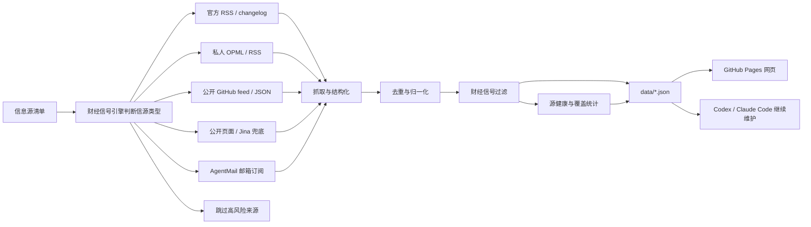

<div align="center">

# 财经雷达 / Finance Radar

## 24 小时全球财经快讯｜财经雷达

**财经信号引擎帮你从海量信息中筛选市场敏感信号。**

[](https://learnprompt.github.io/finance-radar/)
[](https://github.com/LearnPrompt/finance-radar/actions/workflows/update-news.yml)
[](LICENSE)

[在线页面](https://learnprompt.github.io/finance-radar/) · [English](README.en.md) · [财经信号引擎](skills/finance-radar/README.md) · [信息源策略](docs/SOURCE_COVERAGE.md)

</div>

---

## 这是什么

财经雷达是一个自动更新的 24 小时全球财经快讯聚合器。

普通用户直接打开网页，看最近 24 小时 A 股、港股、美股财经快讯。维护者可以 fork 这个仓库，接入自己的 OPML/RSS、公开 feed、静态页面或 AgentMail 邮箱情报。Codex / Claude Code 这类 Agent 可以使用项目内置的 **财经信号引擎**，继续帮你判断信息源、维护抓取逻辑、部署 GitHub Pages。

这个项目不是“又一个新闻网页”。

它的核心是**财经信号引擎**，帮你从一堆信源里选出千里马。哪些源值得长期追踪，哪些源适合做成RSS/OPML，哪些源只能接付费的API，哪些源看起来更新很多但实际上跟你长期关注的方面比方财经只占了里面的5%不到。

先判断清楚，再接入。

## 为什么需要财经信号引擎

财经快讯分散在各处，

官方博客发一点，更新日志发一点，X 上有人提前爆料，聚合站又把同一个新闻转来转去。

我以为的自己在追前沿，实际每天都在重复三件事，

打开几十个页面，肉眼+人脑过滤重复内容，猜哪条值得看。

财经信号引擎先替你完成第一轮判断，**哪些信源是千里马，哪些是噪音**。

你可以随意增加信息源，还可以把一个信息源纳入输入范围，先让它在单独的展示区域运行一个月，再判断要不要录入。

财经雷达从来都不是单纯把信息抓回来，

它更像是一条轻量的新闻pipeline，把来源判断、抓取、去重、财经信号过滤、信息源健康状态和静态网页发布串起来，上线后不消耗模型额度。

## 现在能做什么

- 内置 28 个财经 RSS 信源：财联社、财新网、FT中文网、华尔街见闻、东方财富（13 个主题）、Bloomberg、Reuters、CNBC 等
- 自动分类标注：快讯、深度、宏观政策、股市、公司事件、大宗商品、国际贸易、债汇、监管政策、产业经济
- 支持自定义 OPML/RSS 批量导入个人财经信源
- 接入 TopHub 聚合源，补足单个 RSS 看不到的盲区
- 支持OPML/RSS批量导入
- 支持 AgentMail 邮箱订阅高质量财经日报
- 输出24小时双视图，`财经信号` 和 `全量`
- 中英双语标题和站点分组
- 覆盖 A 股、港股、美股三大市场，中英双语标题

## 工作原理



财经雷达学习了现代新闻学的技术，不是简单堆信息源，一次性放几万条信息出来等于没用，所以我选择把新闻处理拆成稳定pipeline，抓取，去重，过滤，补充状态，生成静态站点。

在保证稳定性的同时追求轻量化，公开版不要求用户配置LLM API Key，不依赖登录态，cookies，X API和邮箱。需要这些进阶能力时，可以通过财经信号引擎用GitHub Secrets或本地环境变量接入。

## 快速开始

普通用户不用安装，直接打开在线页面即可。

想fork改造新版本，可以本地运行：

```bash
git clone https://github.com/LearnPrompt/finance-radar.git
cd finance-radar
python3 -m venv .venv
source .venv/bin/activate
pip install -r requirements.txt
python scripts/update_news.py --output-dir data --window-hours 24
python -m http.server 8080
```

打开：

```text
http://localhost:8080
```

如果你有自己的 OPML：

```bash
cp feeds/follow.example.opml feeds/follow.opml
# 把自己的订阅源写进 feeds/follow.opml，不提交这个文件
python scripts/update_news.py --output-dir data --window-hours 24 --rss-opml feeds/follow.opml
```

## 给Agent看的教程

如果你想让Codex / Claude Code / OpenClaw / Hermes帮你搭自己的版本，可以直接说：

```text
请使用财经信号引擎，先问我要信息源清单，然后帮我判断每个信源该用RSS、公开feed、静态页面、Jina兜底、AgentMail邮箱还是跳过。目标是部署一个不需要服务器、能用GitHub Actions自动更新的财经日报网站。不要把任何API Key、cookies、token、私有邮件内容写入仓库。
```

项目内置 Skill 在：

- `skills/finance-radar/README.md`
- `skills/finance-radar/SKILL.md`

新Agent接手验收时，推荐先读：

- `README.md`
- `README.en.md`
- `docs/GPT_HANDOFF.md`
- `docs/SOURCE_COVERAGE.md`
- `docs/V2_PRODUCT_BRIEF.md`

## GitHub 自动更新

`.github/workflows/update-news.yml` 已经配置好定时任务。

- 默认每 30 分钟运行一次
- 自动生成并提交 `data/*.json`
- 如果没有设置 `FOLLOW_OPML_B64`，线上工作流会自动使用公开示例 `feeds/follow.example.opml`，让页面展示 RSS/OPML 能力
- 如果设置 `FOLLOW_OPML_B64`，会优先自动解码为私有 `feeds/follow.opml`
- 如果设置 `EMAIL_DIGEST_ENABLED=1`、`AGENTMAIL_API_KEY`、`AGENTMAIL_INBOX_ID`，会生成脱敏邮箱摘要
- 只有额外设置 `EMAIL_DIGEST_PUBLISH=1`，才会提交 `data/email-digest.json`
- 如果设置 `X_API_ENABLED=1`、`X_BEARER_TOKEN` 和预算变量，会在每日指定UTC窗口用官方X API抓取少量公开Post；默认关闭，且当前X API按返回资源计费

默认情况下，本项目不需要任何API Key就能跑核心流程。高级源配置模板见 `examples/advanced-sources.env.example`，预算说明见 `docs/research/advanced-source-free-tier-budget-2026-05-10.md`，X API演示配置见 `docs/guides/x-api-demo-config.md`；单账号/单newsletter演示见 `docs/guides/rileybrown-alphasignal-demo.md`。

## License

[MIT](LICENSE)
